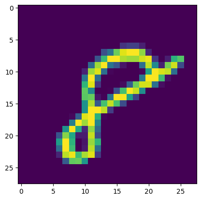

# Image Classification with Neural Networks

  

This project walks through building image classification models from scratch using PyTorch, starting from a simple linear classifier and progressing to deep multilayer neural networks.
This project implements neural networks from scratch using PyTorch, starting from a simple linear classifier and progressively building deeper neural networks for image classification on the MNIST dataset.

The goal of this project is to understand the mathematical and implementation details behind modern deep learning models without relying on high-level abstractions.

---

#  What This Project Covers

- Linear models
- Cross entropy loss
- Gradient descent
- Stochastic Gradient Descent (SGD)
- Mini-batch training
- Custom DataLoader
- Weight initialization
- ReLU activation
- Two-layer neural networks
- Deep multi-layer neural networks
- MNIST image classification

---

#  Project Structure

- SuperML.ipynb
- README.md

---

# Learning Flow

The notebook follows the progression below:

## 1️⃣ Load and Visualize MNIST Dataset

- Download MNIST using `torchvision`
- Visualize handwritten digit images
- Understand image dimensions and labels

---

## 2️⃣ Data Preprocessing

- Flatten images from `28 × 28` → `784`
- Normalize pixel values between `0` and `1`
- Prepare train and test datasets

---

## 3️⃣ Linear Classification Model

Implements a linear classifier:

$$
h(X) = XW^T
$$

Topics covered:

- Weight initialization
- Forward propagation
- Logits
- Prediction

---

## 4️⃣ Cross Entropy Loss

Implements cross entropy loss from scratch:

$$
L_{CE}(\hat{y}, y)
=
-\hat{y}_y
+
\log \sum_j e^{\hat{y}_j}
$$

Topics covered:

- Softmax intuition
- Loss computation
- Classification objectives

---

## 5️⃣ SGD Optimization

Implements Stochastic Gradient Descent manually:

$$
w := w - \eta \nabla L(w)
$$

Topics covered:

- Gradient computation
- Backpropagation
- Learning rate
- Parameter updates

---

## 6️⃣ Custom DataLoader

Builds a sequential mini-batch DataLoader:

- Batch iteration
- Efficient training loops
- Mini-batch optimization

---

## 7️⃣ Training the Linear Model

Train the classifier on MNIST:

- Training loop
- Loss tracking
- Error computation
- Evaluation on test set

---

## 8️⃣ Two-Layer Neural Network

Extends the model using:

$$
h(x) = W_2 \, \text{ReLU}(W_1 x)
$$

Topics covered:

- Hidden layers
- ReLU activation
- Nonlinear learning

---

## 9️⃣ Multi-Layer Neural Network

Implements deeper neural networks using arbitrary hidden layers:

$$
h(x) =
W_L \sigma(W_{L-1}\sigma(...W_1x))
$$

Topics covered:

- Deep learning intuition
- Multi-layer architectures
- Improved representation learning

---

#  Results

The project visualizes:

- Training loss
- Test loss
- Classification error
- Model predictions

This demonstrates how deeper neural networks significantly outperform simple linear models on image classification tasks.

---

#  Goal of This Project

This project is designed to build intuition for:

- How neural networks work internally
- How backpropagation updates parameters
- Why nonlinear activations matter
- How deep learning models learn patterns from data

---

# Key Insight

A single linear layer can only learn linear decision boundaries.

Adding hidden layers and nonlinear activations allows neural networks to learn complex patterns and significantly improve classification performance.